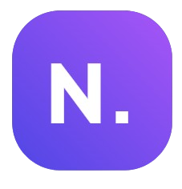

# Noteo - Application de Gestion de Notes Académiques ✨

## Description

Noteo est une application web conçue pour aider les étudiants à gérer leurs notes académiques de manière efficace. Elle offre une interface utilisateur intuitive et des fonctionnalités complètes pour suivre les moyennes, organiser les matières et analyser les performances scolaires. L'application utilise un design moderne avec glassmorphism et propose des options de personnalisation pour améliorer l'expérience utilisateur.

## Fonctionnalités Principales

- **Gestion des matières:** 📚
  - Création, modification et suppression de matières.
  - Définition de la couleur pour chaque matière.

- **Gestion des notes:**
  - Ajout, modification et suppression de notes avec coefficients.
  - Calcul automatique des moyennes par matière et générale.
  - Affichage des notes avec la date.

- **Visualisation des données:**
  - Graphiques interactifs 📊 pour analyser les performances (moyennes, distribution des notes, etc.).
  - Différents types de graphiques disponibles (barres, lignes, radar, etc.).
  - Mode plein écran pour les graphiques.

- **Gestion des périodes:**
  - Organisation des notes par périodes 📅 (semestres ou trimestres).
  - Ajout, suppression et renommage des périodes.

- **Authentification:**
  - Protection des comptes par code PIN 🔒 (4, 6 ou 8 chiffres).
  - Possibilité de réinitialiser le code PIN via un email de récupération simulé.
 🎨
- **Personnalisation:**
  - Thèmes clair et sombre avec option de thème système.
  - Options de configuration pour le son, les animations, le flou, etc.
  - Mode Zen pour une interface utilisateur minimaliste.
  - Police dyslexique pour améliorer la lisibilité.

- **Import/Export des données:**
  - Export complet du compte 📤 (profil, notes, paramètres).
  - Export sélectif des données par période.
  - Import des données à partir de fichiers JSON.

- **Interface utilisateur:**
  - Design moderne avec glassmorphism.
  - Interface responsive adaptée aux mobiles et aux tablettes.

## Technologies Utilisées

- **HTML:** Structure de la page web. 🌐
- **CSS:** Style visuel de l'application avec glassmorphism.
- **JavaScript:** Logique de l'application, gestion des données et interactivité.
- **Chart.js:** Bibliothèque JavaScript pour la création de graphiques.
- **LocalStorage:** Stockage des données utilisateur dans le navigateur.
  
## Utilisation

1. **Créer un nouveau compte:** ➕
   - Remplir le formulaire avec le prénom, le nom et le type de période (semestres ou trimestres).
   - Cliquer sur "Créer un compte".

2. **Se connecter à un compte existant:**
   - Si des comptes existent déjà, ils seront affichés sur l'écran de sélection.
   - Cliquer sur le compte pour se connecter.
   - Entrer le code PIN si le compte est protégé.

3. **Gérer les matières et les notes:**
   - Utiliser le formulaire d'ajout de matière pour en ajouter une et le site calcule les notes et moyenne automatiquement.
   - Les notes sont affichées dans des cartes avec la moyenne calculée.

4. **Explorer les graphiques:**
   - Naviguer vers l'onglet "Analyses" pour visualiser les données.
   - Sélectionner les matières à afficher et choisir un type de graphique.
   - Les graphiques gardent les moyennes selectionnées sauf si vous cliquez sur Mettre à jour.

5. **Personnaliser l'application:**
   - Ouvrir les paramètres pour modifier le thème, les sons, etc.

## Auteur

  - Créé par **Pyro** ( profil : https://github.com/Pyronixus) ✍️

## Licence

Ce projet est sous licence Licence MIT (URL). 📜

## Structure du Code

  - `index.html`: Structure principale de l'application.
  - `style.css`: Styles CSS pour l'apparence de l'application. 🎨
  - `script.js`: Logique JavaScript de l'application. (accessibles dans `Source/`)
  - `assets/`: Dossier contenant les ressources (images, polices, etc.).

## Configuration

L'application peut être configurée via le menu des paramètres. Les options
incluent:

  - **Thème:**
      - Clair
      - Sombre
      - Système (détection automatique du thème du système d'exploitation)
  - **Sons:** Activation/désactivation des effets sonores.
  - **Volume des sons:** Ajustement du volume des effets sonores.
  - **Autres options:** Mode Zen, navigation fixe, affichage de l'avatar,
    animations, etc.

## Maintenance

Cette application est conçue pour être simple à maintenir. Les données sont
stockées localement dans le navigateur, ce qui signifie qu'il n'y a pas de base
de données à gérer. ✅
